# Keybindings & Tabs

| Key | Action |
| --- | --- |
| `↑`/`↓` | move through instances and their nested dbs |
| `s` / `r` | start/stop toggle / restart (confirm popup) |
| `[` / `]` | switch tab in the detail pane |
| `f` | maximize/minimize the focused pane |
| `p` / `l` / `c` / `t` | Top / Logs / Config / Toolbox |
| `u` / `l` / `j` / `c` / `m` / `p` | Users / Locks / Jobs / Crons / Mail / Params |
| `K` | kill -9 the selected process (Top and Processes tabs, confirm popup) |
| `L` | kill -3 the selected process, then jump to Stacks (Top tab) |
| `D` | dump stacks of all workers, then jump to Stacks |
| `S` | copy the instance's `odoo shell` launch command to the clipboard |
| `e` | cycle compact/explain/expand/clean (Config tab) |
| `A` | show all rows, inactive ones included |
| enter | run the selected tool (Toolbox tab, confirm popup) / open a Jobs group / open a row's raw json (db tabs) |
| escape | back out of a Jobs group, or of a row's raw json |
| `/` | search |
| `R` | refresh the active tab now |
| `q` | quit |

Two tabs on each side have no letter shortcut — cycle to them with
`[`/`]` or click: **Processes** and **Stacks** (instance mode), **Queries**
and **Modules** (database mode).

`A` asks `odoo-db` for the rows it filters out by default (its `--all`
flag). Against a host whose `odoo-db` predates that flag, the tab falls
back to the default rows and `A` says so instead of doing nothing.

## Moving around

Three zones, walked with the arrow keys: the instances list, the tab strip,
and the tab body.

```
instances list  ──enter, or ↓ off the last row──►  tab strip  ──↓──►  tab body
       ▲                                              ▲  │              │
       └──────────────────── ↑ ───────────────────────┘  └───── ↑ ──────┘
                                                          (at its top row)
```

`enter` is the way in rather than `↓`, because the list is a tree: an
instance with databases nested under it is never the last row, and `↓` there
belongs to the row below it — which is a database, carrying the other mode's
tabs. On the strip, `←`/`→` move between tabs and `↑` goes back to the list;
in the body, `↑` at the top row goes back to the strip, and anywhere else it
scrolls as usual.

While the pane is maximized (`f`) the strip keeps `↑` to itself — the list
isn't on screen to go back to, and `f` is what leaves that view.

The letter shortcuts and `[`/`]` still jump straight to a tab from anywhere,
and `Tab`/`Shift+Tab` still cycle focus.

## Modes

The detail pane mode-switches on whatever's highlighted in the instances
list:

- **Instance mode** — an instance row is highlighted. Tabs: Top,
  Processes, Stacks, Logs, Config, Toolbox.
- **Database mode** — one of its nested database rows is highlighted. Tabs:
  Queries, Users, Locks, Jobs, Crons, Mail, Modules, Params, Toolbox.

Both modes share the same tab strip, and several letter-key shortcuts are
reused across them for whichever tab they map to in each (e.g. `l` is Logs
in instance mode, Locks in database mode).

### Instance mode tabs

#### Top (`p`)

Every worker under the instance's master pid — `ps -eo
pid,ppid,user,%mem,args`, walked down from the master, sorted by live CPU%.

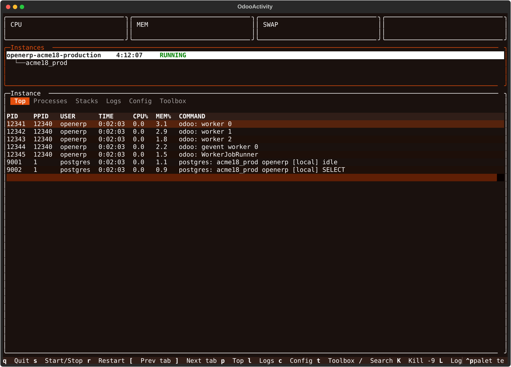

#### Processes

The same workers, grouped by role instead of sorted by load — Main, Job
Runner (queue_job), Cron Worker, Longpolling Worker (gevent), HTTP Worker.
Only refreshed when the tab is (re)opened, unlike Top. See
[Architecture](reference/architecture.md) for how a role is detected.

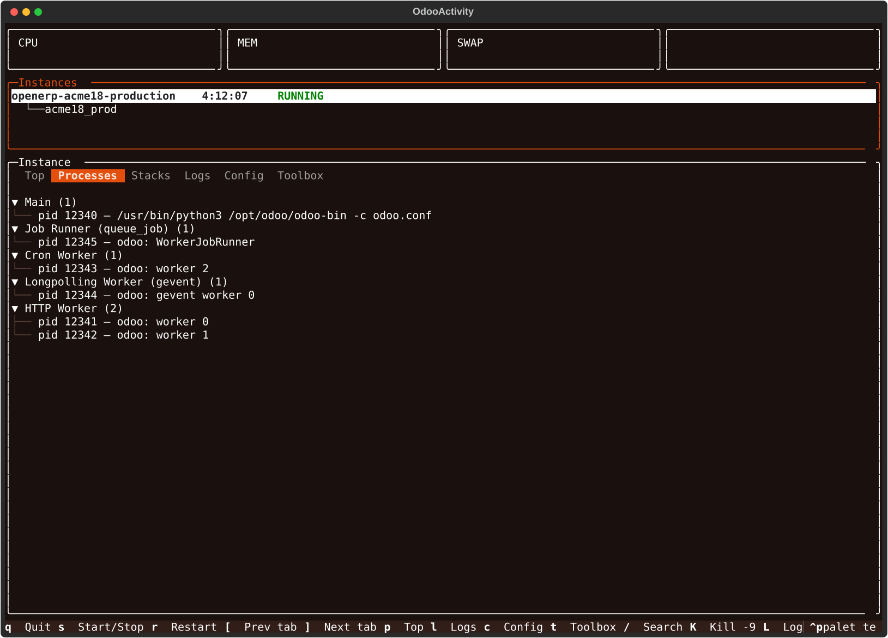

#### Stacks

Parsed `dumpstacks` output, busy threads first, so a wedged worker's own
call stack is the first thing visible. `D` dumps every worker and jumps
here; `L` does the same for one selected process (Top tab).

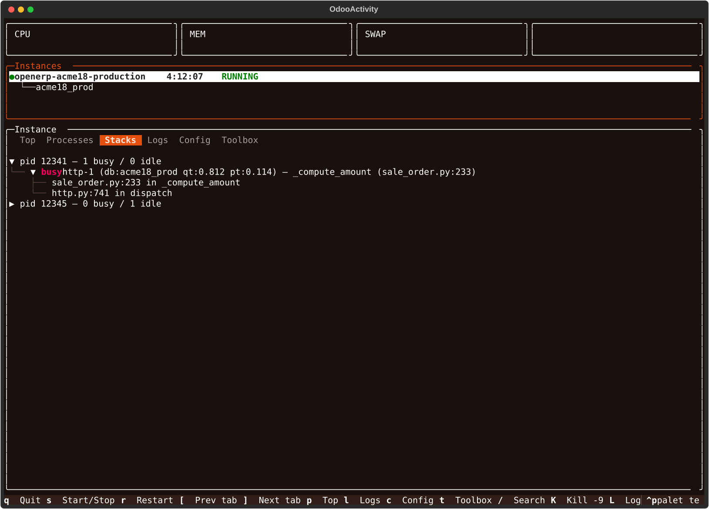

#### Logs (`l`)

Tails the instance's configured `logfile`, reading backward in fixed-size
chunks so a multi-GB file costs a few reads, not a full scan.

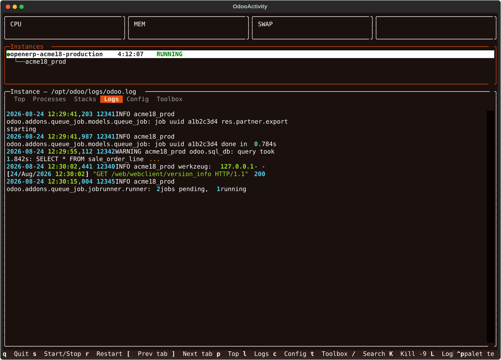

#### Config (`c`)

`e` cycles `odoo-config`'s `compact`/`explain`/`expand`/`clean` views of
the instance's config file — see [odoo-config's CLI docs][odoo-config-cli]
for what each one shows.

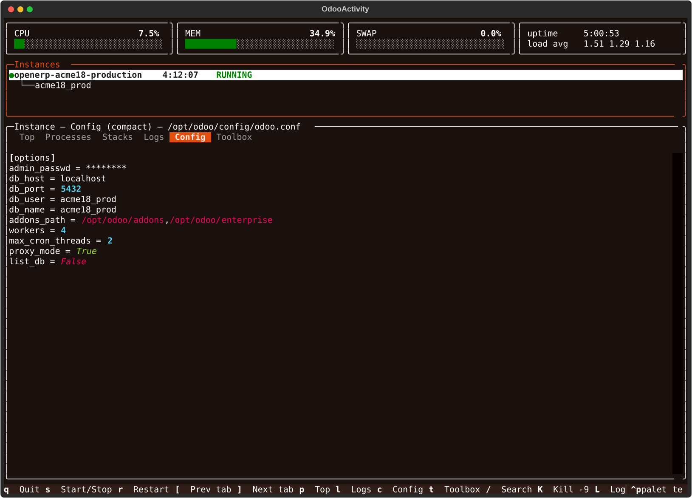

### Database mode tabs

#### Queries

`odoo-db`'s long-running queries against this database — `pid`, how long
each has been running, its state, and the query text itself.

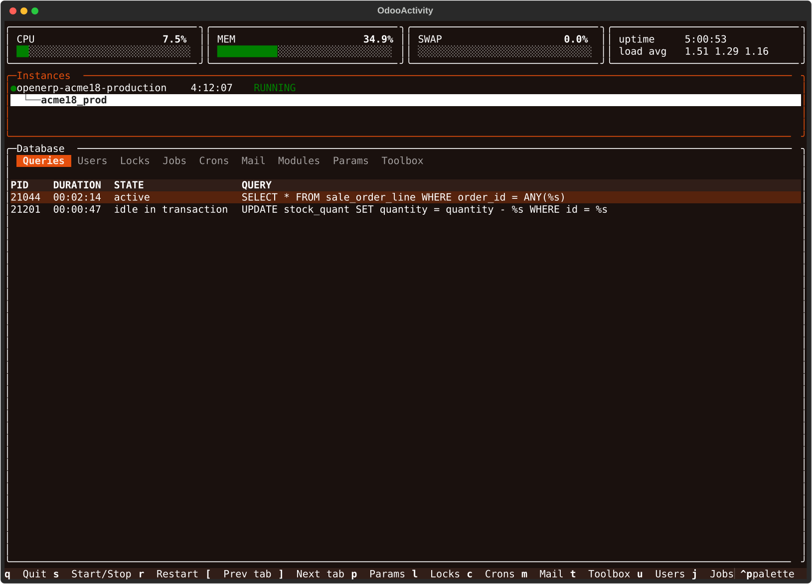

#### Users

Every `res.users` row on the database.

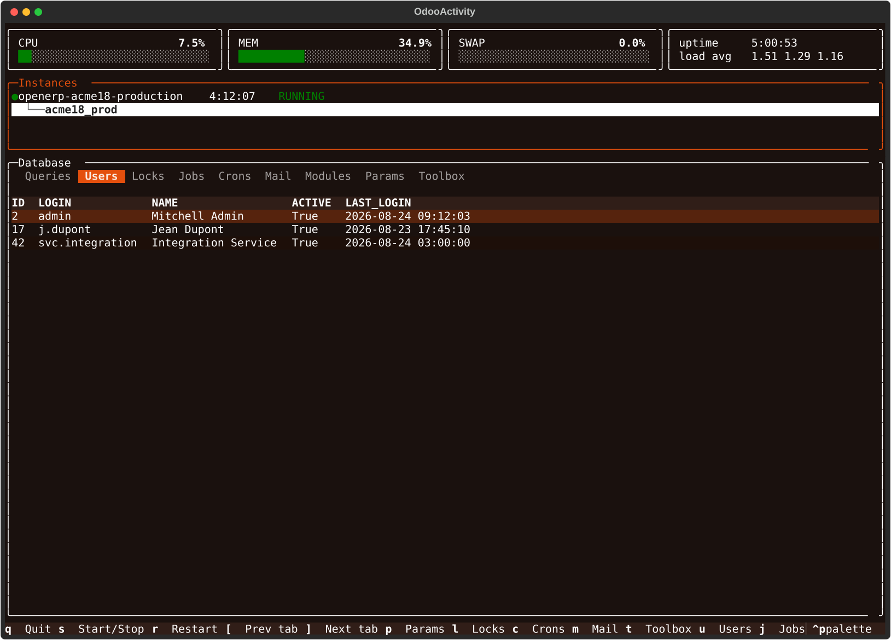

#### Locks

Postgres locks currently held or waited on against this database.

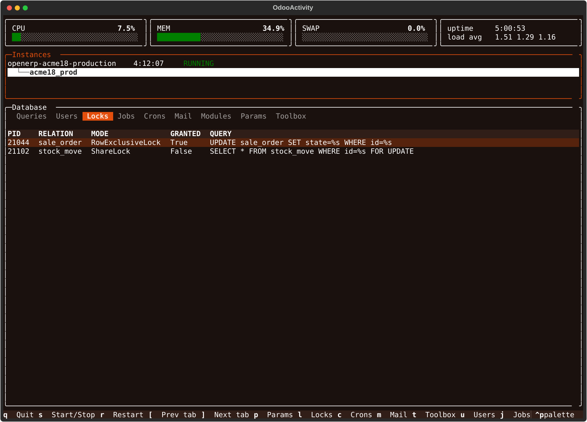

#### Crons

Every `ir.cron` row — active state, interval, and next scheduled run.

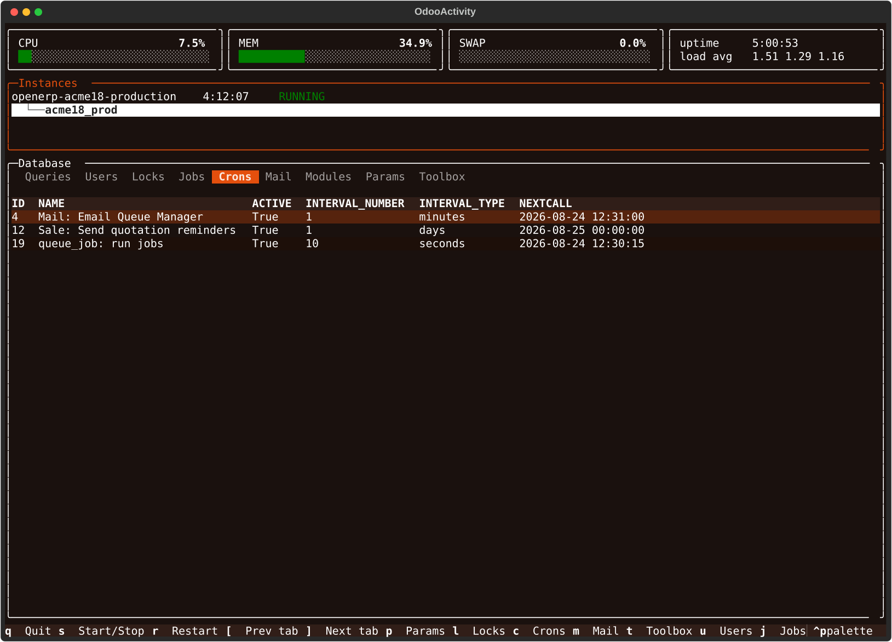

#### Modules

Installed/to-upgrade modules on this database.

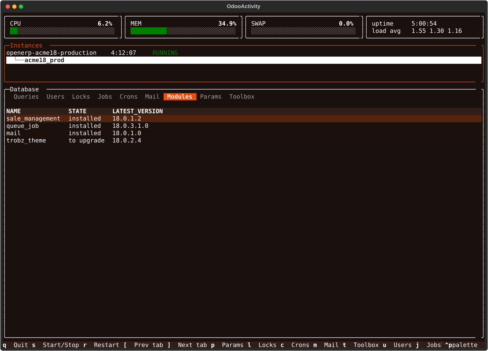

#### Params (`p`)

`ir_config_parameter` rows; `/` filters by key or value. Secret-looking
values (`password`, `token`, an `enterprise_code`, ...) show unmasked by
default — you already have a shell on this host. Pass
`--no-include-sensitive-information` to keep odoo-db's own masking instead.

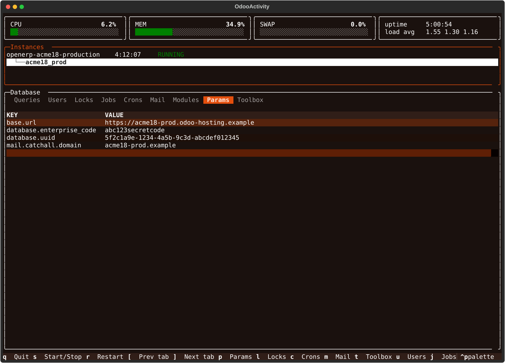

## Jobs (`j`)

queue_job's jobs grouped by function and state, numbered, with the oldest
creation date and the longest wait/run in each group — which is what a job
stuck in `started` for hours looks like. Enter opens a group as its
individual jobs (numbered too, `date_created`/`date_started` each, oldest
first, capped at 500), escape backs out, and enter on one of those opens its
raw json.

Under the table is the tab's action strip — buttons that act on the
database rather than on the row under the cursor. Jobs has one: **Requeue
jobs** puts every `started`/`enqueued` job back to `pending` (after a
confirm popup — including jobs a live worker is still running, which will
then run again), clearing the dates that go with those states the way
queue_job's own `set_pending` does — what a runner does for its own dead
jobs at startup, for when a worker was killed mid-job and nothing else
will revisit the row.

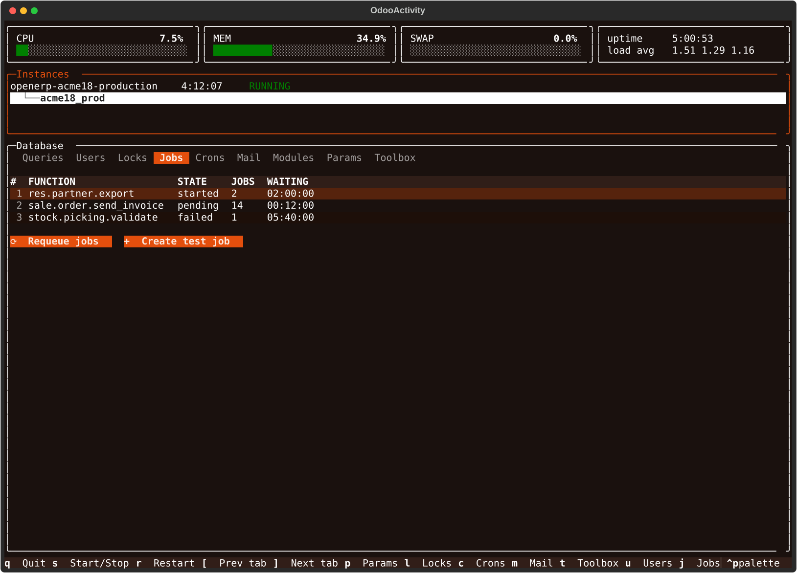

## Mail (`m`)

`odoo-db mail <db>` audits outbound mail config (config parameters,
per-company alias domains, addresses, outgoing mail servers, relevant
modules) as one nested object rather than a flat row list, rendered as its
own set of tables in the log body. Outgoing mail servers is shown first,
with test-catcher/known-relay/neutralization-stub detection surfaced as
summary lines below the table. A neutralized database
(`database.is_neutralized` — every odoo.sh staging build) leads with its
own red banner, since it's the single most common reason mail never
leaves an Odoo database at all.

Mail always shows a **Check port 25** button (no odooly needed — a plain
network probe): `nc -z -w 3 localhost 25` on the target host, the question
that matters once `mail_servers` is empty and Odoo falls back to
`localhost:25` for outgoing mail.

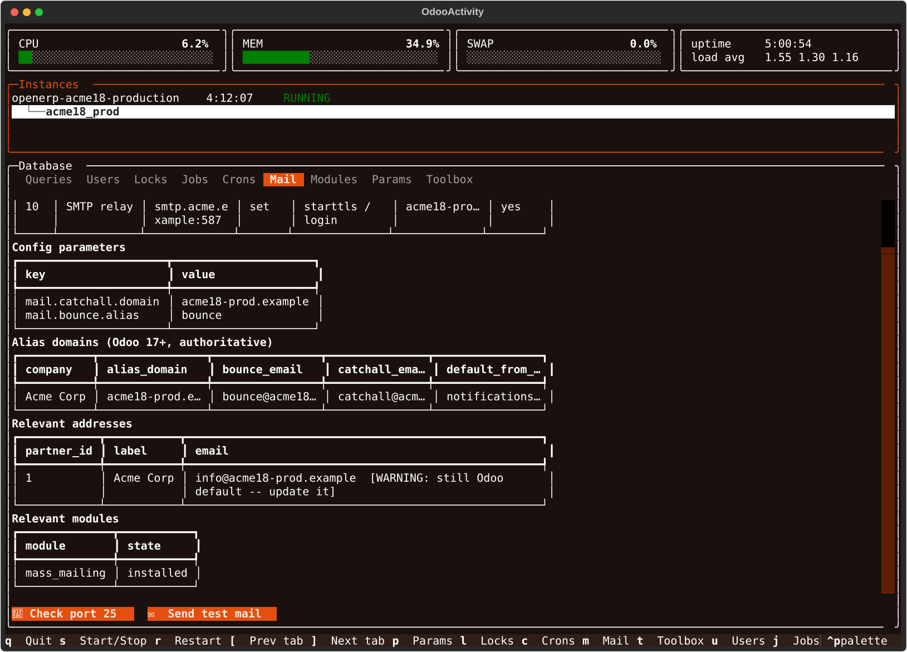

## Odooly (experimental)

`oa --enable-odooly` reads `~/odooly.ini` at startup and matches each
database against it. Every database then carries an `ODOOLY` tag in the
instance rows' status column — green where an environment reaches it, and
the actions that need a login appear with it; red where none does, so a
database missing from the ini is visible rather than silent.

Matching is by name: the instance's, stripped of what only a process
manager adds (`openerp-acme18-integration.service` → `acme18-integration`),
against the section names — spelled either way (`-integration` /
`-int`, `-staging` / `-stag`, `-production` / `-prod`), and with a suffix
allowed, since a multi-db instance is usually configured one section per
database (`acme18-int-db1`). A section that names a `database` only
matches that one.

Database > Toolbox then offers:

- **Open odooly** — copies `odooly -c ~/odooly.ini --env <env>` to the
  clipboard (`-c`, because odooly's own CLI looks for the ini in the
  working directory).
- **Restore app icons** — for a database restored without its filestore,
  where the apps menu comes up blank. It rewrites `web_icon` on the menus
  whose icon data is missing, so running it twice is a no-op.

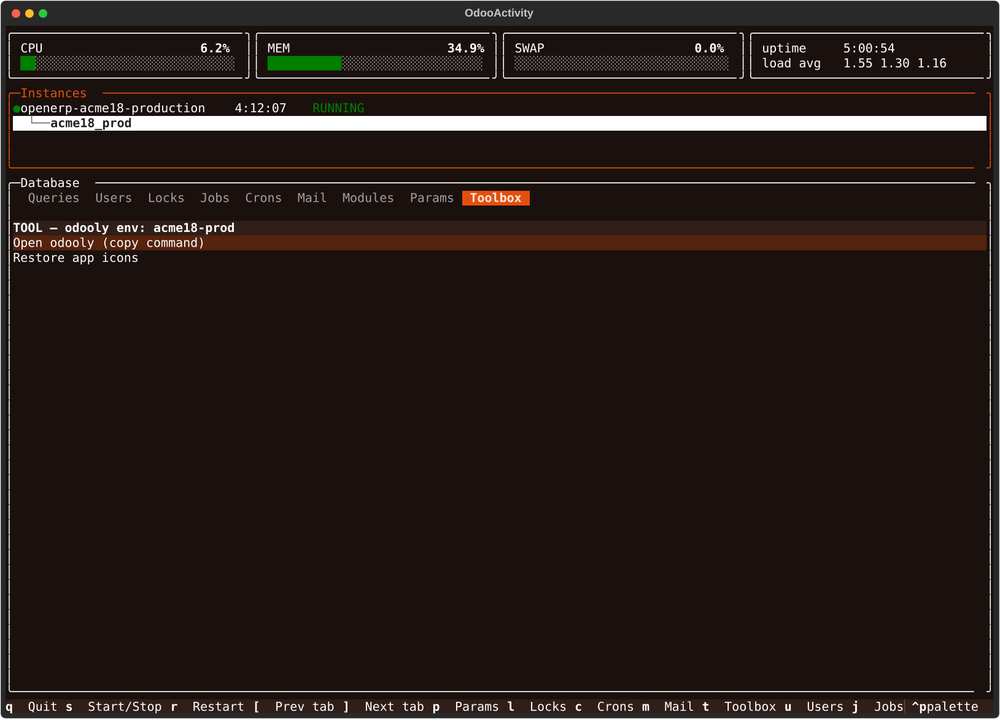

Jobs grows a **Create test job** button next to Requeue, which queues one
of queue_job's own test jobs to see whether a runner picks it up, and Mail
grows a **Send test mail** button, which prompts for a recipient and sends
one real email (calling `.send()` directly, so it goes out synchronously
rather than waiting on the mail queue cron) from the connecting user's own
company address.

All three scripts live in `odoo_activity/scripts/` and run on their own
too:

```bash
python -m odoo_activity.scripts.restore_app_icons --env acme18-int
python -m odoo_activity.scripts.create_test_job --env acme18-int
python -m odoo_activity.scripts.send_test_mail --env acme18-int --to me@example.com
```

They always run on **this** machine, even when `oa` is watching a remote
host: odooly reaches the instance over the network, using the
`~/odooly.ini` that is here, not there.

## Toolbox (`t`)

- Spin a worker up (`SIGTTIN`) or down (`SIGTTOU`).
- Open shell — copies the launch command instead of signaling, so it needs
  no confirm.
- Count sessions under the instance's data dir (walks the filesystem, may
  be slow).

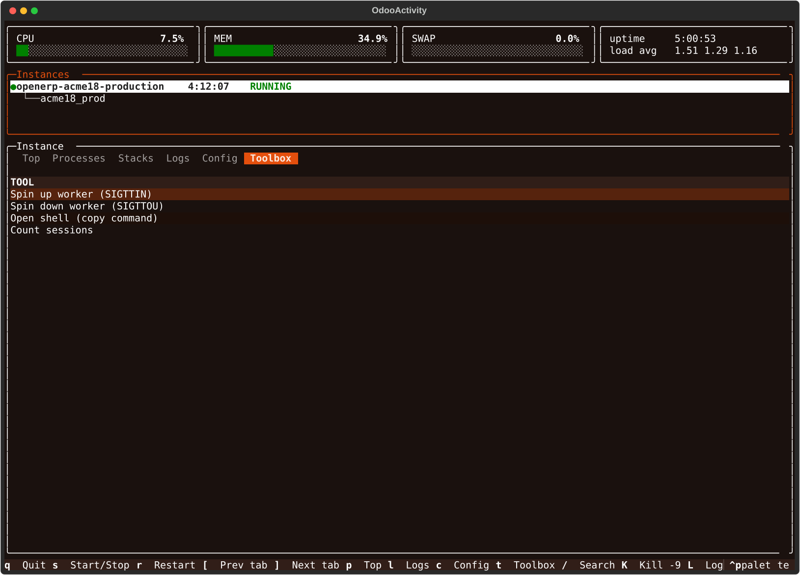

## Remote hosts

The target is any ssh destination — `[user@]host` or a `~/.ssh/config`
alias. Only the tools already required locally are needed, but on the
remote host. Connections are multiplexed, so the first call opens the
session and the rest reuse it.

Everything still refreshes on its own against a remote host, just on a
slower tick — host stats and Top every 5s, the instance list every 15s.
`R` refreshes the active tab immediately, plus the instance list and the
highlighted instance's databases.

[odoo-config-cli]: https://github.com/trobz/odoo-config/blob/main/CLI.md
